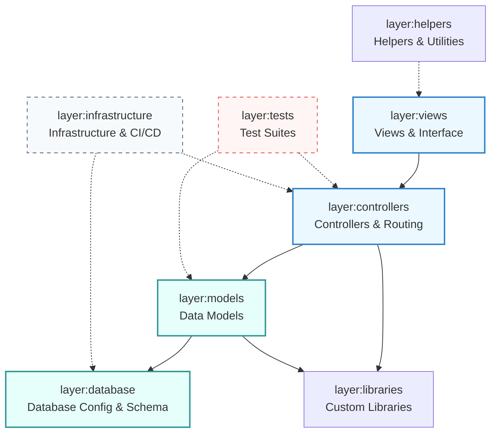

# Understanding CodeWorkout — Codebase Architecture & Visualisation Guide

This guide provides an overview of the **Understand Anything** framework used to map the CodeWorkout codebase, along with a detailed breakdown of the architectural layers and guided learning tour designed for this project.

---

## 🛠️ The Understand Anything Framework

The **Understand Anything** framework is an automated codebase visualization and mapping system that processes code repositories into a structured, queryable knowledge graph. The graph is stored locally in `.understand-anything/knowledge-graph.json` and visualised via an interactive dev server.

### Pipeline Phases
1. **Pre-flight & Exclusions (`Phase 0 - 0.5`)**: Validates environment, checks Git history, and sets up `.understandignore` to filter out non-source directories (e.g. `node_modules`, `tmp`, asset caches).
2. **Deterministic Scan (`Phase 1`)**: Walks the directory tree, identifies file categories (`code`, `config`, `docs`, `infra`, `data`, `script`, `markup`), counts lines, and extracts relative internal imports using Tree-Sitter parsers.
3. **Semantic Batching (`Phase 1.5`)**: Groups highly related files (e.g., matching controller-model-view sets or adjacent specs) into modular batches to optimize context limits and preserve local relevance.
4. **Structural Analysis (`Phase 2`)**: Extracts function signatures, class boundaries, export lists, database schemas, endpoints, and calls in parallel batches using static analysis wrappers.
5. **Deduplication & Merge (`Phase 3`)**: Aggregates batch results, canonicalizes node IDs, normalizes complexity values, and filters out dangling edges (e.g., imports referencing external gems or deleted assets).
6. **Architectural Layering (`Phase 4`)**: Allocates every scanned file to exactly one logical architectural layer based on path conventions, import density, and functional dependencies.
7. **Guided Tour Synthesis (`Phase 5`)**: Designs a pedagogical traversal starting from entry points, tracing outward through core business logic and infrastructure layers.
8. **Validation & Save (`Phase 6 - 7`)**: Formats the compiled data into the canonical `knowledge-graph.json` schema, saves meta state, and constructs a structural fingerprint baseline for subsequent fast, incremental updates.

---

## 🏛️ Codebase Architectural Layers

Every source and configuration file in CodeWorkout has been assigned to exactly one of the **10 logical architectural layers** below. This establishes a clean separation of concerns, mapping from core data schema definitions up to HTTP orchestrators and front-end render engines.



### Layer Detail & Allocations

| Layer ID | Name | Description | File Count | Key Components / Directories |
|---|---|---|:---:|---|
| `layer:controllers` | **Controllers & Routing** | Handles incoming HTTP requests, session actions, and request routing. | **26** | `app/controllers/`, `app/active_admin/` |
| `layer:models` | **Data Models** | Represents core domain entities, relationships, and validations. | **59** | `app/models/` |
| `layer:views` | **Views & Interface** | Haml templates, ERB templates, and frontend style sheets. | **211** | `app/views/`, `app/assets/stylesheets/` |
| `layer:helpers` | **Helpers & Utilities** | Reusable rendering utilities supporting view scripts. | **7** | `app/helpers/` |
| `layer:libraries` | **Custom Libraries** | Background jobs, mailers, daemons, and core library code. | **45** | `lib/`, `app/jobs/`, `app/mailers/`, `usr/` |
| `layer:database` | **Database & Schema** | Database schemas, lookup values, and Active Record migrations. | **218** | `db/migrate/`, `db/seeds.rb`, `db/schema.rb` |
| `layer:infrastructure` | **Infrastructure & CI/CD** | Container files, systemd configurations, and setup scripts. | **31** | `Dockerfile`, `docker-compose.yml`, `*.service`, `*.sh` |
| `layer:configuration` | **Project Config** | Configuration, environment presets, and package files. | **116** | `config/`, `Gemfile`, `package.json` |
| `layer:tests` | **Test Suites** | RSpec test suites, factory presets, and quality validations. | **105** | `spec/`, `test/` |
| `layer:documentation` | **Documentation** | Guides, accessibility audits, and compliance logs. | **107** | `README.md`, `docs/`, `wcag_compliance_report.md` |

---

## 🗺️ Guided Learning Tour

To help a developer onboard onto the CodeWorkout codebase, a **8-step guided learning tour** has been constructed, leading from broad conceptual context to active request handlers, core models, database configurations, and Docker host containers.

### Tour Step Summary

```carousel
# Slide 1: Tour Steps 1 & 2
### Step 1: Introduction to CodeWorkout
* **Target Nodes**: [README.md](file:///Users/edwards/git/code-workout/README.md)
* **Focus**: Concept and Setup
* **Description**: Start here to understand the core purpose of CodeWorkout: an open-source platform helping students learn programming via interactive practice exercises and multiple-choice questions. This guide introduces the development flow and database setup.

### Step 2: Application Boot & Settings
* **Target Nodes**: [config/application.rb](file:///Users/edwards/git/code-workout/config/application.rb)
* **Focus**: Boot and Autoloads
* **Description**: Examine how Rails bootstrap settings, module autoloading, and initial configurations are defined, booting up the foundational runtime environment for CodeWorkout.
* **Educational Note**: In Ruby on Rails, `config/application.rb` is the central configuration file where module autoloading and core frameworks are initialized.

<!-- slide -->
# Slide 2: Tour Steps 3 & 4
### Step 3: HTTP Routing & API Map
* **Target Nodes**: [config/routes.rb](file:///Users/edwards/git/code-workout/config/routes.rb)
* **Focus**: Entry points and controllers mappings
* **Description**: Explore the routing map of CodeWorkout. This file maps browser URLs and external LTIs (Learning Tools Interoperability) directly to controllers and their corresponding actions.

### Step 4: Base Orchestration Layer
* **Target Nodes**: [app/controllers/application_controller.rb](file:///Users/edwards/git/code-workout/app/controllers/application_controller.rb)
* **Focus**: Base Controllers and Security filters
* **Description**: Inspect the parent controller class that establishes key response behaviors, authentication checks via Devise, authorization gates via CanCanCan, and core filters applied to all controllers.
* **Educational Note**: `ApplicationController` uses Devise for session management and CanCanCan for role-based security validation.

<!-- slide -->
# Slide 3: Tour Steps 5 & 6
### Step 5: Interactive Exercise Execution
* **Target Nodes**: [app/controllers/exercises_controller.rb](file:///Users/edwards/git/code-workout/app/controllers/exercises_controller.rb)
* **Focus**: Practice Submissions & Feedback
* **Description**: Understand how interactive exercise actions are coordinated: managing practice submissions, loading workouts, and feeding feedback back to students.

### Step 6: Data Blueprint & Active Record Core
* **Target Nodes**: [app/models/user.rb](file:///Users/edwards/git/code-workout/app/models/user.rb), [app/models/exercise.rb](file:///Users/edwards/git/code-workout/app/models/exercise.rb), [app/models/workout.rb](file:///Users/edwards/git/code-workout/app/models/workout.rb)
* **Focus**: Core Entities
* **Description**: Explore the primary domain entities. Users represent students/instructors, Exercises represent specific practice challenges, and Workouts represent structured sets of practice problems.

<!-- slide -->
# Slide 4: Tour Steps 7 & 8
### Step 7: Database Schema Layout
* **Target Nodes**: [db/schema.rb](file:///Users/edwards/git/code-workout/db/schema.rb), [db/seeds.rb](file:///Users/edwards/git/code-workout/db/seeds.rb)
* **Focus**: Persistence Layer
* **Description**: Analyze the active database schema defining user roles, exercise definitions, terms, and courses, along with seeds defining baseline lookup tables.
* **Educational Note**: `db/schema.rb` is the canonical representation of the active database layout, loaded during setup instead of running all legacy migration scripts.

### Step 8: Infrastructure Packaging
* **Target Nodes**: [Dockerfile](file:///Users/edwards/git/code-workout/Dockerfile), [docker-compose.yml](file:///Users/edwards/git/code-workout/docker-compose.yml)
* **Focus**: Local sandboxing & Services
* **Description**: Review how CodeWorkout containerizes its Rails server and MariaDB databases using Docker and Docker Compose, ensuring a reproducible local development sandbox.
* **Educational Note**: Docker Compose ties multiple services together, creating isolated web application, development database, and testing database containers.
```

---

## 📊 Visualisation and Dashboard

To interactively explore the codebase using the visual dashboard, follow these steps:

1. **Start the Dashboard Dev Server** (if it is not already running):
   ```bash
   cd ~/.understand-anything-plugin/packages/dashboard
   GRAPH_DIR=/Users/edwards/git/code-workout npx vite --host 127.0.0.1
   ```
2. **Access the Visual Interface**:
   Open the browser at the following tokenized URL to bypass the access token gate:
   [http://127.0.0.1:5174/?token=6c1dcce5dd12be0aa6270ea5d77ef80f](http://127.0.0.1:5174/?token=6c1dcce5dd12be0aa6270ea5d77ef80f)

From the dashboard, you can browse through the **10 layers**, walk the **8-step guided tour**, and visualize live dependency relationships between any function, model, controller, or config node.
